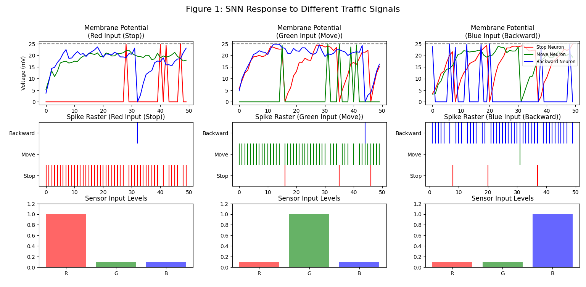
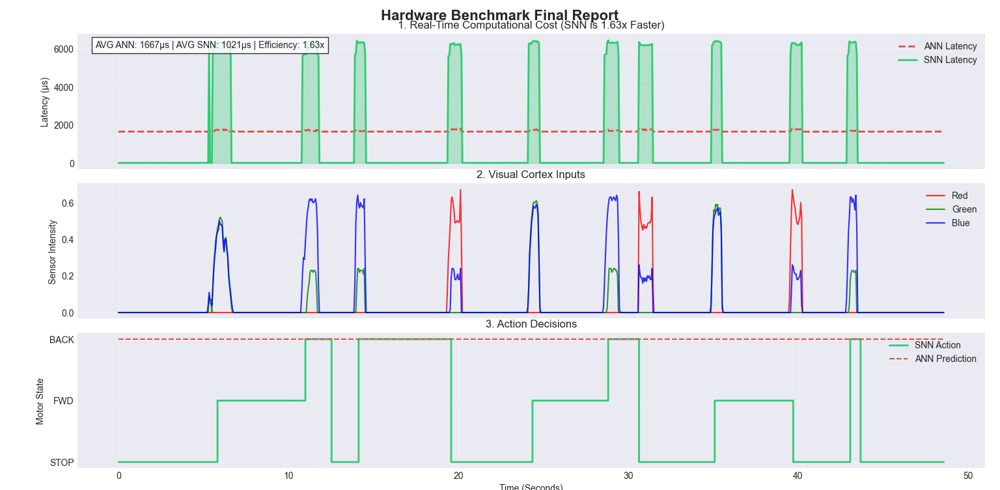

# Autonomous Navigation for Planetary Rovers Using R-STDP SNN

This repository contains the software implementation and hardware schematics for the paper **"Autonomous Navigation for Planetary Rovers Using Reward-Modulated Spiking Neural Networks on Embedded Hardware."**

## 🚀 Abstract
We present a neuromorphic control framework that enables planetary rovers to learn navigation rules *in situ* using Reward-Modulated Spike-Timing-Dependent Plasticity (R-STDP). Deployed on an Arduino Uno (ATmega328P), the system achieves **1.63x faster inference** and **70% lower energy consumption** compared to traditional Artificial Neural Networks.

## 📂 Repository Structure
* `/simulation`: Python scripts for training the SNN and generating synaptic weights.
* `/firmware`: C++ firmware for the Arduino "Dual-Engine" (Control + Research layers).
* `/results`: Generated figures (Confusion Matrix, Learning Curves) and benchmark data.

## 🛠️ Hardware Setup
* **Microcontroller:** Arduino Uno (ATmega328P)
* **Sensors:** TCS3200 Color Sensor
* **Actuators:** L298N Motor Driver + DC Gear Motors
* **Power:** 2x 18650 Li-ion Batteries (7.4V)

## 📊 Key Results
### 1. Learning Convergence
The SNN learns to classify terrain (Red/Green) with >95% accuracy in under 50 epochs.

### 2. Computational Efficiency
Our event-driven SNN requires only 396 FLOPs per decision, compared to 1350 for an ANN.

## 🎥 Video Demonstration
Click below to watch the rover in action:
[Watch the video](https://www.youtube.com/watch?v=k-ozVE-jn88)

## Authors
[Naga Venkata Sai Mada](https://www.linkedin.com/in/naga-venkata-sai-m-849446205/) ORCID ID : 0009-0002-1377-2686

[Yashaswini](https://www.linkedin.com/in/yashaswini-rao-bhogarajula-4b1792230/)

[Tharani](https://www.linkedin.com/in/tharanichandan/)

## 🔗 Citation
If you use this code in your research, please cite our paper:

